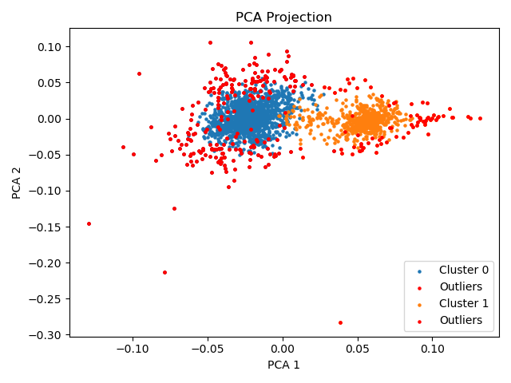

# Tobias Safie - Portfolio
[toby.safie@gmail.com](mailto:toby.safie@gmail.com) | [tks57@drexel.edu](mailto:tks57@drexel.edu) | [linkedin.com/in/tsafie](linkedin.com/in/tsafie)
---

I am a Physics, Economics, and Mathematics triple major at Drexel University in Philadelphia, PA and this is a curated selection of my favorite work across **physics**, **machine learning**, and **quantitative finance**.

---

## Featured Projects

### **NASA Fermi GRB Clustering**
Developed ML pipelines for the **unsupervised clustering** of over 750k high-noise **gamma-ray bursts (GRBs)** to identify outlier astrophysical events detected by the Fermi Telescope. This is a sub-project under a wider multi-stage project created by my mentor, Dr. Niharika Sravan, to create an ML pipeline for NASA's radio team.
 
_This project was tackled under the mentorship of and collaboration with Dr. Niharika Sravan and Dr. Tomas Ahumada_
  
**Tools**: Python, PyTorch, Scikit-Learn, Pandas, DataWrangler, GoogleCloud, UMAP, t-SNE, PCA
 
**Highlights**:
- Built high-dimensional autoencoder pipelines to extract latent features from raw GRB time series
- Utilized academic and industry standard architectures including: Transformer, CNN, LSTM, TS2-Vec
- Optimized handling of >750k bursts × 14 detectors × ~1k timesteps (≈10¹⁰ total data points)
- Applied clustering and dimensionality reduction (t-SNE, PCA) to identify hidden temporal–spectral patterns
 

<table>
  <tr>
    <td align="center">
       
      <em>t-SNE projection of latent GRB features</em>
    </td>
    <td align="center">
       
      <em>PCA projection of latent GRB features</em>
    </td>
  </tr>
</table>

 

### **Physics-Informed Neural Networks for Options Pricing**
Developed and benchmarked Physics-Informed Neural Networks (PINNs) to approximate nonlinear partial differential equations (PDEs) across domains in physics and ultimately derivative pricing models. 
 
_Conducted as part of Drexel’s Students Tackling Advanced Research (STAR) Scholars program during Summer '25._
 
**Tools**: Python, PyTorch, Pandas, NumPy, Kaggle
 
**Highlights**:
- Built PyTorch-based PINN framework to approximate nonlinear PDEs in physics and quantitative finance  
- Implemented the Heston stochastic volatility and Black–Scholes models using physics-informed constraints  
- Benchmarked against RK4 solvers and finite-difference methods for stability and convergence analysis  
- Produced high-resolution solution surfaces, residual heatmaps, and model ablation studies  
- Designed architecture modularity for extension to inverse problems and multi-physics coupling
 

<table>
  <tr>
    <td align="center">
       
      <em>Black-Scholes PDE solution surface predicted by PINN</em>
    </td>
    <td align="center">
       
      <em>PINN-predicted solution of the 1D diffusion equation over time (test case)</em>
    </td>
  </tr>
</table>

 
