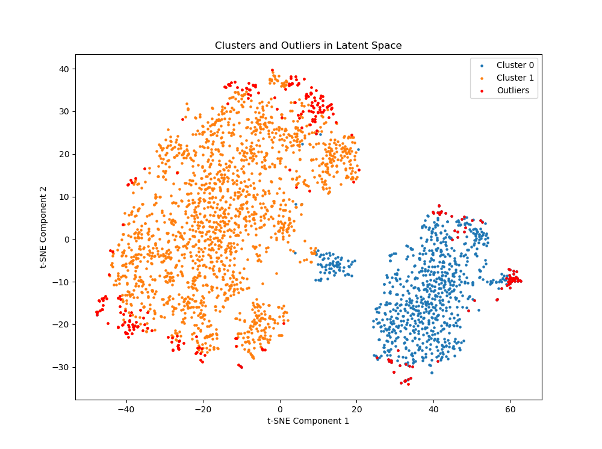
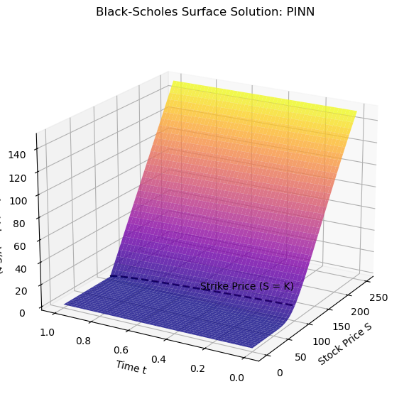
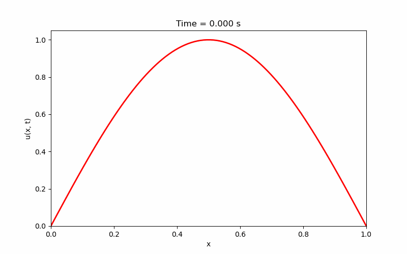
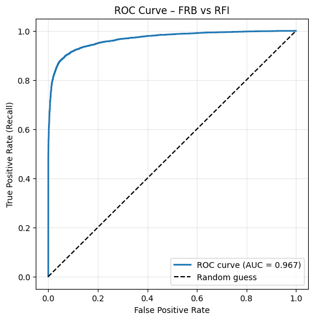
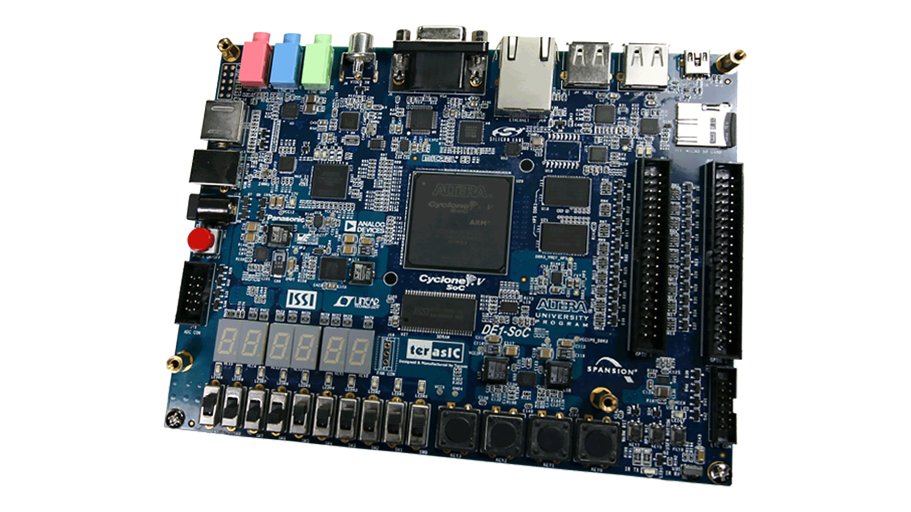
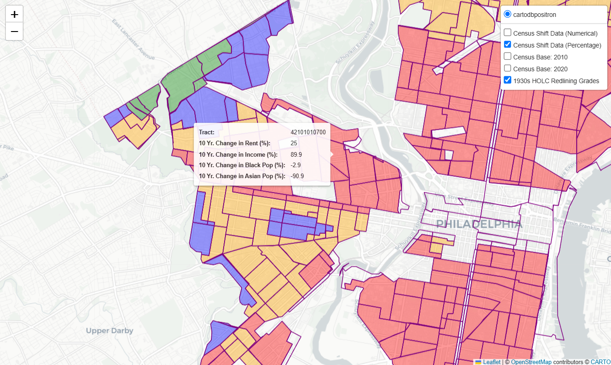
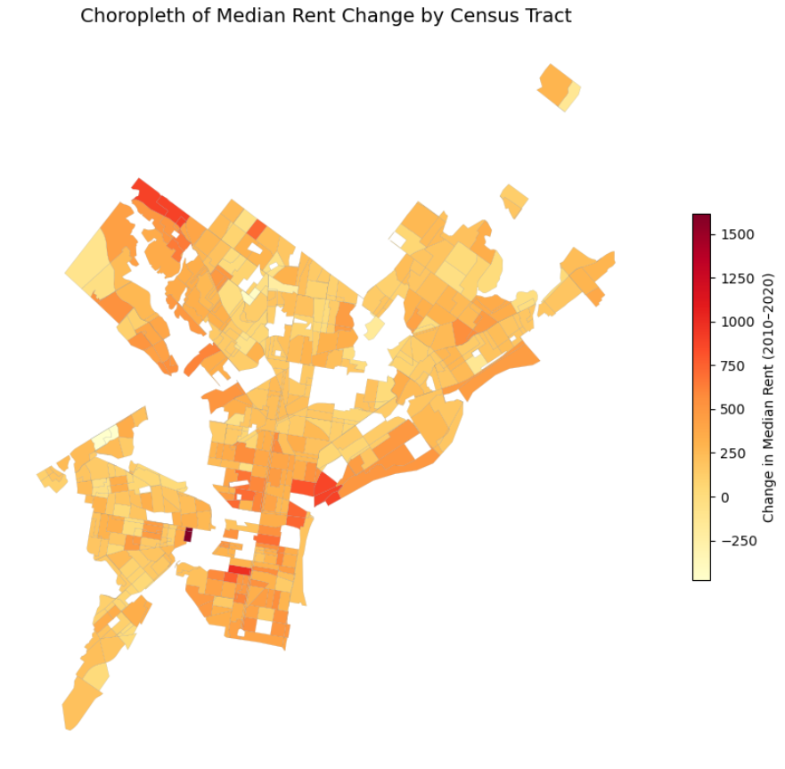
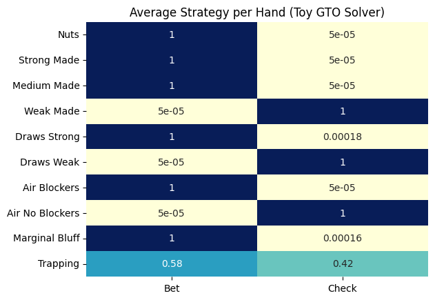
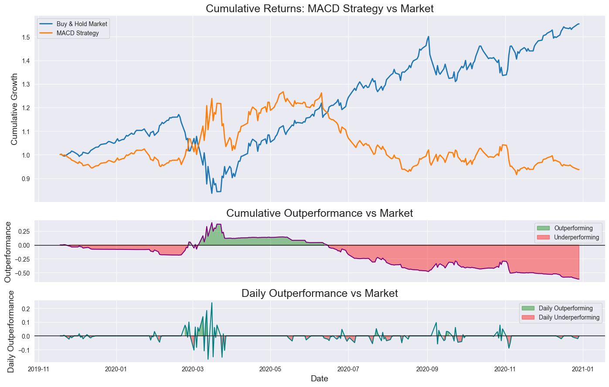

# Tobias Safie - Portfolio
[toby.safie@gmail.com](mailto:toby.safie@gmail.com) | [tks57@drexel.edu](mailto:tks57@drexel.edu) | [linkedin.com/in/tsafie](linkedin.com/in/tsafie)
---

I am a Physics, Economics, and Mathematics triple major at Drexel University in Philadelphia, PA and this is a curated selection of my favorite work across **physics**, **machine learning**, and **quantitative finance**.
  
Each repository is linked in the **title** of each listed project.

---

## Featured Projects

### [**NASA Fermi GRB Clustering**](https://github.com/tahumada/GBM-ML)
Developed ML pipelines for the **unsupervised clustering** of over 750k high-noise **gamma-ray bursts (GRBs)** to identify outlier astrophysical events detected by the Fermi Telescope. This is a sub-project under a wider multi-stage project created by my mentor, Dr. Niharika Sravan, to create an ML pipeline for NASA's radio team.
 
_This project was tackled under the mentorship of and collaboration with Dr. Niharika Sravan and Dr. Tomas Ahumada_
  
**Tools:** Python, PyTorch, Scikit-Learn, Pandas, DataWrangler, GoogleCloud, UMAP, t-SNE, PCA
 
**Highlights:**
- Built high-dimensional autoencoder pipelines to extract latent features from raw GRB time series
- Utilized academic and industry standard architectures including: Transformer, CNN, LSTM, TS2-Vec
- Optimized handling of >750k bursts × 14 detectors × ~1k timesteps (≈10¹⁰ total data points)
- Applied clustering and dimensionality reduction (t-SNE, PCA) to identify hidden temporal–spectral patterns
 

<table>
  <tr>
    <td align="center">
       
      <em>t-SNE projection of latent GRB features</em>
    </td>
    <td align="center">
       
      <em>PCA projection of latent GRB features</em>
    </td>
  </tr>
</table>

 

### [**Physics-Informed Neural Networks for Options Pricing**](https://github.com/tobiassafie/STAR)
Developed and benchmarked Physics-Informed Neural Networks (PINNs) to approximate nonlinear partial differential equations (PDEs) across domains in physics and ultimately derivative pricing models. 
 
_Conducted as part of Drexel’s Students Tackling Advanced Research (STAR) Scholars program during Summer '25._
 
**Tools:** Python, PyTorch, Pandas, NumPy, Kaggle
 
**Highlights:**
- Built PyTorch-based PINN framework to approximate nonlinear PDEs in physics and quantitative finance  
- Implemented the Heston stochastic volatility and Black–Scholes models using physics-informed constraints  
- Benchmarked against RK4 solvers and finite-difference methods for stability and convergence analysis  
- Produced high-resolution solution surfaces, residual heatmaps, and model ablation studies  
- Designed architecture modularity for extension to inverse problems and multi-physics coupling
 

<table>
  <tr>
    <td align="center">
       
      <em>Black-Scholes PDE solution surface predicted by PINN</em>
    </td>
    <td align="center">
       
      <em>PINN-predicted solution of the 1D diffusion equation over time (test case)</em>
    </td>
  </tr>
</table>

 

### [**Fast Radio Burst FPGA Classifier**](./frb/simple_model_accuracy.ipynb) - _Work in Progess_
Designing a real-time inference pipeline to detect and classify Fast Radio Bursts (FRBs) from live telescope data. The project integrates machine-learning models with low-level hardware acceleration for efficient and low-latency on-device signal processing.
 
_Another project developed under Dr. Niharika Sravan that has seen many collaborators and contributors._
 
**Tools:** Python, TensorFlow, Verilog, C++, Scikit-Learn, hls4ml, FPGA
 
**Highlights:**
- Building an end-to-end pipeline for FRB detection and classification using CNN architectures
- Converting trained Sk-Learn models to low-level representations for deployment on an FPGA
- Implementing real-time signal ingestion and preprocessing for telescope data streams
- Targeting efficient inference under strict parameter and memory constraints (<100k parameters)

<table>
  <tr>
    <td align="center">
       
      <em>Historic ROC curve for FRB classifier showing strong discrimination (AUC = 0.967)</em>
    </td>
    <td align="center">
       
      <em>Target FPGA platform for real-time deployment</em>
    </td>
  </tr>
</table>

 

### [**Urban Displacment Mapping Tool**](https://github.com/tobiassafie/reverse-redlining)
Developed a Python-based data visualization tool to analyze and map patterns of gentrification and economic displacement in Philadelphia. This project combines historical redlining maps with modern census, eviction, and mortgage approval data to reveal how historic inequities persist in housing and income distribution.
 
_Conducted independently as an extension of a research paper I wrote for my university's student anthology, **The 33rd**._
 
**Tools**: Python, Pandas, GeoPandas, Folium, Plotly, Jupyter
 
**Highlights**:
- Integrated datasets from the **HOLC Redlining Maps**, **ACS Census**, and **Eviction Lab**
- Computed tract-level changes in rent, household income, and racial composition
- Built an interactive map overlay showing the correlation between historical red zones and modern eviction or rent-increase hotspots
- Automated data cleaning and geospatial joins using **GeoPandas** and **Folium**
- Designed visual layers for presentation and community engagement

<table>
  <tr>
    <td align="center">
       
      <em>Overlay of historical HOLC redlining zones on current census tracts</em>
    </td>
    <td align="center">
       
      <em>Choropleth of median rent change by census tract</em>
    </td>
  </tr>
</table>

 

### [**GTO Poker Strategy Simulator**](https://github.com/tobiassafie/gto-poker-sim) - _Work in Progress_
Developing a Python-based game-theoretic poker simulator to model optimal mixed strategies under incomplete information. The project applies Monte Carlo simulation and reinforcement-learning methods similar to those used in quantitative finance and algorithmic trading.
 
_A fun project I designed to help me learn poker and get a little more competitive than just beating my college game night._
 
**Tech:** Python, NumPy, Pandas, Matplotlib, Seaborn
 
**Highlights:**
- Implementing hand-bucket abstraction and EV-based decision models  
- Visualizing equilibrium heatmaps and exploitability metrics  
- Experimenting with regret minimization and reinforcement-learning approaches (CFR)  
- Planned extensions: real-time opponent modeling and adaptive counter-strategies

<table>
  <tr>
    <td align="center">
       
      <em>Equilibrium betting frequencies across 10 hand buckets in the toy GTO solver, illustrating optimal mixed strategies under balanced play.</em>
    </td>
  </tr>
</table>

### [**Quantitative Backtester Dashboard**](https://github.com/tobiassafie/quant-backtester)
[**Link to the app**](quantbacktester.streamlit.app)
 
Developed an interactive framework for backtesting and visualizing quantitative trading strategies on historical market data. Built using **Streamlit**, the tool allows users to configure parameters, visualize trades, and compare multiple strategy performances in real time. May be recycled in the future to algorithmically trade **event contracts** using **Kalshi's API**.
 
_Built independently as a way to familiarize myself with algorithmic trading and ML methods in finance._
**Tech:** Python, Pandas, NumPy, Matplotlib, Streamlit
**Highlights:**
- Modular architecture with five implemented strategies: SMA Crossover, EWMA Crossover, MACD, RSI–Bollinger, and ATR Breakout  
- Integrated analytics for Sharpe Ratio, Sortino Ratio, CAGR, Profit Factor, and Max Drawdown  
- Built interactive overlays for buy/sell markers and indicator signals  
- Designed an extensible structure for adding new strategies and custom metrics  
- Deployed interactive demo using Streamlit Cloud  

   
  <em>Performance of the MACD trading strategy versus a buy-and-hold benchmark, showing cumulative growth, relative outperformance, and daily alpha.</em>

